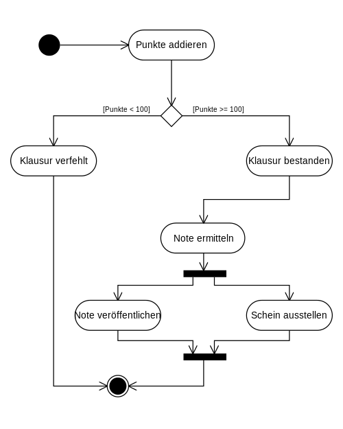
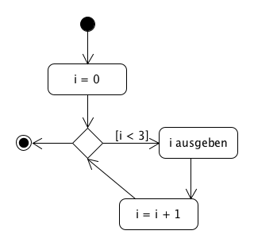
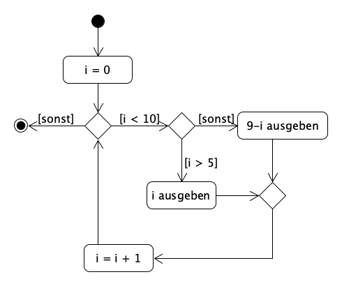
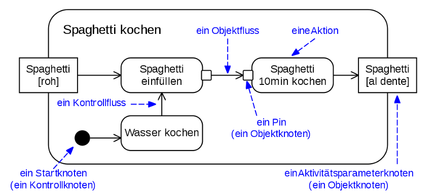

# UML-Aktivitätsdiagramme

## Notation



- Start- und Endknoten
- Aktivitäten mit abgerundete Ecken
- Verzweigungen durch Rauten
- Bedingungen/Guards in eckigen
- Klammern
- Schwarze Balken für Parallelisierung,
- treten paarweise auf.

## Einfache Schleifen

```python
for i in range(3):
    print(i)
```



## komplexere Schleifen

```python
for i in range(10):
    if i > 5:
        print(i)  
    else:
        print(9-i)
```



## Aktivitätsdiagramme Version 2



(Quelle: [Wikipedia: Aktivitätsdiagramm](https://de.wikipedia.org/wiki/Aktivit%C3%A4tsdiagramm))

## Tools

- [Umlet/Umletino](http://www.umletino.com/umletino.html)
- [draw.io/diagrams.net](https://app.diagrams.net/)
- [plantuml](https://plantuml.com/)
- Stift/Papier/Whiteboard

## Übungen aus IHK-Prüfungen

- [Übungen](https://tbseins-my.sharepoint.com/:f:/g/personal/bakera_tbs1_de/EvgRkzwZmxRCqywrOTtyAmIBf8JFXuq3LaTmIjnjFlBDkg?e=bJ2k8F)
  - 2016 Winter
  - 2015 Winter

Pro Aufgabe 23,5 Minuten (in der Prüfung)
